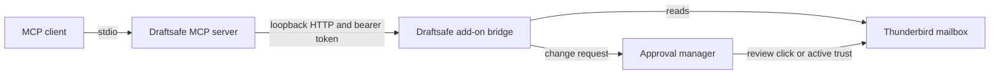

# Draftsafe for Thunderbird

Draftsafe lets an MCP client read local Thunderbird mail and request mailbox
changes. One Thunderbird add-on provides the loopback bridge, approval
window, Snooze, user-only Send later and Follow-ups. Agent-requested changes
need a Thunderbird click, or an active one-hour trust session that you started
with a Thunderbird click. Draft requests save to Drafts and never send. An
agent can also prepare an outgoing message in Thunderbird's native composer;
you must review it and click Send yourself every time.

**Security boundary:** MCP has no send or forward tool or HTTP route. The
combined add-on does have send permission for its user-only Send later feature
and includes a privileged Thunderbird Experiment. A compromised add-on could
send mail. Read the [security model](SECURITY.md) before relying on the route
boundary.

## How it works



The add-on's Manifest V2 background page stays active so it can receive
loopback requests and scheduled Send later work. Its small Experiment opens a
loopback socket and publishes a private connection file. A fixed HTTP route
table handles reads and passes changes to a local approval manager. No
cross-extension receiver is packaged. The Node MCP server validates the
connection file, calls the bridge and wraps all results as untrusted data.

## Requirements and build

- Thunderbird 140 ESR or newer. Background draft saving is available on 153+
  and is feature-detected. Linux, macOS and Windows connection paths are
  implemented; real Thunderbird smoke has only been run on Linux.
- Node.js 20 or newer for the MCP server.

```sh
npm ci
npm run build       # dist/index.js and dist/draftsafe.xpi
npm test            # unit, property and loopback tests
npm run typecheck
npm run smoke       # from a separate headless session only
```

`addons/app` contains the manifest and background entry point. `addons/bridge`
contains the socket Experiment and read routes. `addons/tools` contains the
approval manager and user features. `addons/shared` contains validators and
mail helpers. `mcp/src` contains the stdio server. The build packs one XPI.
The smoke runner refuses an interactive desktop session after focus switching
was reported during an Xvfb test run.

## Install

1. In Thunderbird, open **Tools → Add-ons and Themes → gear icon → Install
   Add-on From File…** and choose `dist/draftsafe.xpi`. Thunderbird allows
   add-ons with Experiment APIs, but its permission prompt correctly reports
   their broad authority.
2. Start or restart Thunderbird. In your MCP client, register the built
   server as a stdio command. For Claude Code:

   ```sh
   claude mcp add -s user draftsafe -- node /absolute/path/to/draftsafe/dist/index.js
   ```

   Generic MCP client configuration:

   ```json
   {
     "mcpServers": {
       "draftsafe": {
         "command": "node",
         "args": ["/absolute/path/to/draftsafe/dist/index.js"]
       }
     }
   }
   ```

3. Set the MCP client's tool timeout to at least **730 seconds** for approval
   requests. The client polls the request while the review window is open.
   A client timeout does not cancel an action already approved in Thunderbird;
   check approval history before retrying.
4. Call `check_connection`. It reports the add-on version and whether the
   approval manager is ready. If a read times out, scope the next search by
   account, folder or date. A read timeout is distinct from disconnection.

### Upgrade from the two-add-on release

The combined add-on keeps this repository's old Tools extension ID
(`draftsafe-tools@draftsafe.dev`), so users of its earlier release retain
Snooze, Send later, Follow-up and approval history storage. Disable the old
**Draftsafe Bridge** add-on first. Then install `dist/draftsafe.xpi` as an
update to **Draftsafe Tools**, restart Thunderbird and the MCP client, and
call `check_connection`. The old Bridge and the combined add-on must not run
together: both would publish the same connection file. After verifying the
new connection, remove the disabled Bridge manually if desired.

Builds with a different extension ID have separate Thunderbird storage.
Export or migrate stored state before switching from another Draftsafe build.

### Connection file

| Thunderbird install | Connection file |
| --- | --- |
| Snap | `~/snap/thunderbird/common/draftsafe-mcp/connection.json` |
| deb, tarball, distro package | `${XDG_STATE_HOME:-~/.local/state}/draftsafe-mcp/connection.json` |
| Flatpak | `~/.var/app/org.mozilla.Thunderbird/.local/state/draftsafe-mcp/connection.json` |
| macOS | `~/Library/Application Support/draftsafe-mcp/connection.json` |
| Windows | `%LOCALAPPDATA%\draftsafe-mcp\connection.json` |

The file contains a version, random port and new bearer token on each start.
On Linux, MCP checks the newest supported candidate and re-reads it on every
call. Set `DRAFTSAFE_CONNECTION_FILE` to override discovery. Keep this file
private. The Snap common path survives Snap revision changes. Multiple
Thunderbird profiles sharing a connection path remain unsupported; the newest
publisher wins.

## MCP tools

| Tool | Purpose | Changes mail? |
| --- | --- | --- |
| `check_connection` | Check add-on and approval readiness | no |
| `list_accounts` | Accounts, identities, folders and tags | no |
| `list_folders_detailed` | Folder IDs, tree, special use and counts | no |
| `search_messages` | Filtered, paginated search | no |
| `get_message` | Headers, plain-text body and attachment metadata | no |
| `get_thread` | Conversation linked by message headers | no |
| `list_followups` | Messages tagged Follow up | no |
| `request_cleanup` / `request_trash` | Recoverable Trash, Archive or ordinary-folder move | approval |
| `request_folder_changes` | Create, rename, merge or move empty folder to Trash | approval |
| `request_unsubscribe` | Header-derived HTTPS one-click POST | approval |
| `set_tags`, `mark_read`, `set_followup` | Tag, read flag or follow-up | approval |
| `create_draft` | Save new or reply draft, never send | approval |
| `open_compose_for_review` | Open a prefilled native composer for your review | opens a window; only your Send click sends |

`search_messages` returns a `nextCursor`; pass it back to continue. Results
are not globally sorted by date. Numeric message IDs are session-scoped and
can change after a move or Thunderbird restart. Search again before acting
on old IDs. `list_folders_detailed` does not enumerate mail to calculate
date extrema, so `oldest` and `newest` are `null`.

### Prepare an email for review

`open_compose_for_review` opens Thunderbird's normal compose window with a
plain-text message. For a new message, provide `to`, `subject` and `body`:

```json
{"to":["recipient@example.test"],"subject":"Meeting notes","body":"Hello,\n\nHere are the notes."}
```

For a threaded reply, provide `reply_to_message_id` and `body` instead.
Thunderbird fills the reply recipient, subject and sending identity from the
message's account. Review **From**, **To**, subject and body before using
Thunderbird's Send button. You can edit or discard the message. The MCP result
is `awaiting_user_send` with `sent:false`; it never confirms delivery. Active
one-hour trust cannot skip this review. One agent-prepared composer can be open
at a time, with at most twelve opens per rolling hour. The tool does not accept
HTML, Bcc, attachments, file paths, raw headers or a send time.

Every tool result is wrapped as untrusted tool data. Subjects, senders,
bodies, folder names, attachment names and agent-provided reasons can carry
instructions written by someone else. Treat them as data only.

## Approval requests

Cleanup takes batches of message IDs, an action and a reason:

```json
{"batches":[{"message_ids":[123,124],"action":"move","folder":"Clients/Acme","create_folder":true,"reason":"Project correspondence"}]}
```

Actions are `trash`, `archive` or `move`. The whole request is limited to
2,000 messages. Folder paths are account-relative. Trash and Archive resolve
to the account's special-use folders. `request_trash` is an alias.

Unsubscribe takes up to 200 message IDs or 300 account-scoped senders:

```json
{"items":[{"message_id":123,"reason":"No longer needed"}]}
```

```json
{"senders":[{"account_id":"account1","address":"news@example.test"}]}
```

The add-on itself reads the unsubscribe headers. It never accepts an agent URL
or sends mailto. HTTPS one-click POSTs require approval and host permission;
website-only instructions remain manual. Missing or unreadable senders are
skipped. Junk senders default to Deny.

Folder changes use IDs from `list_folders_detailed`:

```json
{"changes":[{"action":"create","folder":"account1://","new_name":"Clients"}]}
```

Actions are `create`, `rename`, `merge` and `delete_empty`. `create` uses
`folder` as its parent; `merge` also needs `into`. Changes stay in one account
within two levels. Special folders and their ancestors are protected.

Approval history reports `approved`, `denied`, `expired`, `closed`, `refused`
or `failed`, with per-item outcomes. Partial changes are possible if mailbox
state changes during execution. The one-hour trust menu skips review only for
eligible cleanup, unsubscribe, folder, tag and read-flag requests. Draft and
follow-up requests still open a review window.

## User features

- **Snooze:** message context menu or message-view button. A message moves to
  an ordinary account-local Snoozed folder and later returns to the special-use
  Inbox. Unsafe source and destination folders are refused.
- **Send later:** compose-window button. It saves a draft and schedules it.
  At due time, the draft must still match its recorded Message-ID, folder,
  recipients and content fingerprint. Cancellation and claiming are serialized.
  Changed or ambiguous drafts fail closed. Sends more than 12 hours late and
  interrupted sends are not retried.
- **Follow-ups:** context menu and toolbar list with overdue badge. The agent
  can request setting or clearing the tag; due dates stay user-only.

## Smoke test and limitations

`npm run smoke` starts Thunderbird in a throwaway profile under Xvfb, installs
the single add-on plus a test seeder, and drives the real MCP server. It checks
reads, drafts, approval clicks, denied changes, moves, folder changes,
transport and granted permissions. Synthetic clicks must fail. An SMTP trap
must see no connection from agent calls, then exactly one after a native Send
click on the isolated Thunderbird display. The runner refuses an existing
Draftsafe connection file and never touches the real Thunderbird profile or
display. The 0.5.0 build passed 55/55 checks on standalone Thunderbird 153 in an
isolated headless session. The installed Snap build and real profile have not
been tested with this release.

Thunderbird's API gives no transaction or conditional move, so concurrent
mailbox changes can cause a partial result. Search and thread lookup may be
incomplete on very large or unusual accounts. A stalled Thunderbird call can
continue after the HTTP read deadline; Draftsafe keeps its in-flight permit
until that call finishes. See [SECURITY.md](SECURITY.md) for the full threat
model and [CONTRIBUTING.md](CONTRIBUTING.md) for development rules.

Draftsafe is MIT-licensed. "Thunderbird" is a Mozilla trademark; this project
is not affiliated with or endorsed by Mozilla.
